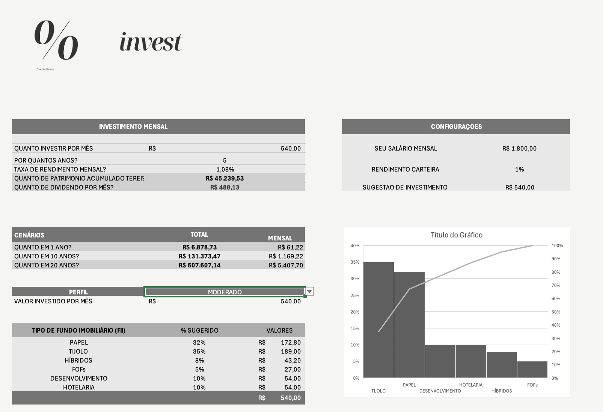
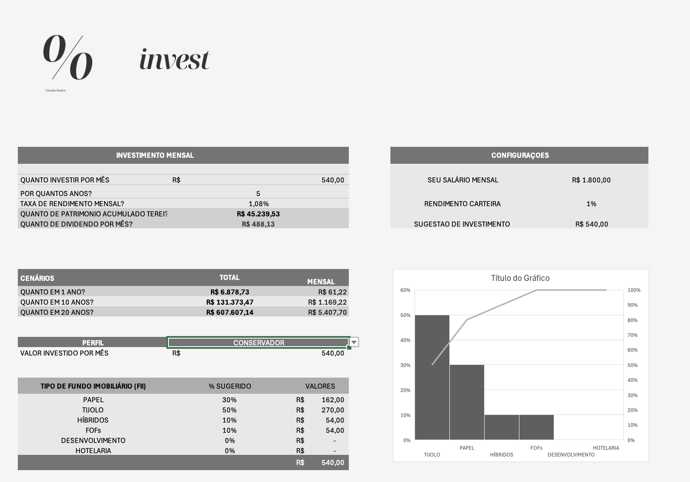

# % invest | Simulador de Fundos Imobiliários no Excel

Planilha com cara de aplicativo que simula investimentos em fundos imobiliários (FIIs), do aporte de cada mês até os dividendos que ele rende. Qualquer pessoa usa sem precisar saber fórmula.

> Projeto de portfólio do curso de Excel da DIO. Todos os valores são **exemplos**, não recomendação de investimento.

## Prints

**Perfil Moderado**

**Perfil Conservador**

## Perguntas que a ferramenta responde

| Pergunta | Onde aparece |
|---|---|
| Quanto investir por mês? | Bloco **Investimento Mensal** (R$ 540,00) |
| Por quantos anos? | Bloco **Investimento Mensal** (5 anos) |
| Qual a taxa de rendimento mensal? | Bloco **Investimento Mensal** (1,08%) |
| Quanto de patrimônio vou acumular? | Bloco **Investimento Mensal** (R$ 45.239,53) |
| Quanto vou receber de dividendos por mês? | Bloco **Investimento Mensal** (R$ 488,13) |

Além das cinco perguntas, a planilha tem:
- **Cenários:** projeção do patrimônio total e dos dividendos mensais em 1, 10 e 20 anos.
- **Configurações:** salário mensal, rendimento da carteira e sugestão de aporte (30% do salário).
- **Divisão por perfil:** escolha o perfil em uma lista e veja o aporte dividido entre seis tipos de FII, com gráfico.

## Como as funções entram nos cálculos

### VF (valor futuro)
Calcula o patrimônio acumulado a partir do aporte mensal, da taxa e do prazo:

`=VF(taxa_mensal; anos*12; -aporte)`

- `taxa_mensal`: rendimento por mês
- `anos*12`: número de períodos (o prazo em anos convertido em meses)
- `-aporte`: valor investido por mês, negativo porque é saída de caixa

Os dividendos mensais saem do patrimônio acumulado multiplicado pela taxa de rendimento. Os cenários repetem o mesmo cálculo para cada prazo, com **referências absolutas** para a fórmula não se perder ao arrastar.

### PROCV com chave composta
A aba de apoio tem a tabela **perfil | tipo de fundo | percentual**. Como o percentual depende dos dois ao mesmo tempo, a busca usa uma chave composta:

`=PROCV(perfil & tipo_fundo; tabela_perfis; coluna; 0)`

Assim, trocar o perfil na lista (validação de dados) atualiza o percentual de cada tipo de fundo, e o valor em reais é `aporte × percentual`.

## Intervalos nomeados

| Nome | Referência |
|---|---|
| `aporte` | [célula do valor investido por mês] |
| `taxa_mensal` | [célula da taxa de rendimento mensal] |
| `[outros nomes que você criou]` | [...] |

## Percentuais por perfil

Exemplo do perfil **Moderado** (soma 100%):

| Tipo de FII | % |
|---|---|
| Tijolo | 35% |
| Papel | 32% |
| Desenvolvimento | 10% |
| Hotelaria | 10% |
| Híbridos | 8% |
| FOFs | 5% |

**Origem:** [explique de onde vieram: adaptados do exemplo do curso, definidos por você etc.]. São apenas ilustrativos e cada perfil soma 100%.

## O que mudei em relação à ferramenta do Expert

- Identidade visual própria: marca **% invest** e paleta em tons de cinza
- [Cenários de 1, 10 e 20 anos, em vez de 2, 5, 10, 20 e 30]
- Gráfico combinando barras (% por tipo de fundo) e linha (% acumulado)
- [Outras mudanças: segunda simulação com 30% do salário, ocultar barra de fórmulas etc.]

## Como usar

1. Baixe `[nome-do-arquivo].xlsx` e abra no Excel.
2. Preencha apenas as células não cinzas: aporte, prazo, taxa e perfil.
3. As células cinzas são calculadas e não devem ser editadas.

## Tecnologias

Microsoft Excel: VF, PROCV, validação de dados, intervalos nomeados e gráficos.

---
Feito por **Claudia Santos**
